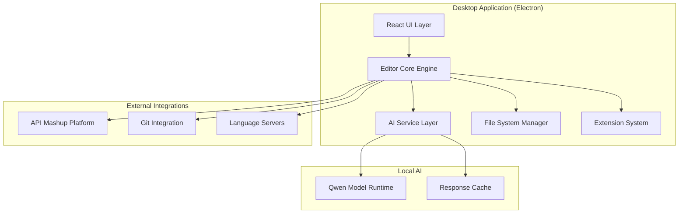

# AI Code Editor Design Document

## Overview

The AI Code Editor is a cross-platform desktop application built using Electron for the UI framework and Node.js for the backend services. The application integrates a local Qwen language model to provide intelligent code assistance while maintaining full IDE capabilities. The editor connects seamlessly with the existing API mashup platform to create a unified development workflow from idea generation to code implementation.

The architecture follows a modular design with clear separation between the UI layer, AI services, editor core, and platform integrations. This ensures maintainability, extensibility, and performance while providing a rich development experience.

## Architecture

### High-Level Architecture



### Component Architecture

The application is structured into several key layers:

**Presentation Layer (React/Electron)**
- Main window management and UI rendering
- Component-based interface with Monaco Editor integration
- Event handling and user interaction management
- Theme and layout management

**Core Engine Layer**
- File management and workspace handling
- Editor state management and document synchronization
- Command palette and action dispatching
- Plugin lifecycle management

**AI Service Layer**
- Local Qwen model integration and management
- Code analysis and suggestion generation
- Context-aware assistance and completion
- Response caching and optimization

**Integration Layer**
- API mashup platform communication
- Version control system integration
- Language server protocol implementation
- External tool and service connections

## Components and Interfaces

### Editor Core Components

**FileManager**
```typescript
interface FileManager {
  openFile(path: string): Promise<Document>
  saveFile(document: Document): Promise<void>
  watchFileChanges(callback: (changes: FileChange[]) => void): void
  createProject(template: ProjectTemplate): Promise<Project>
}
```

**WorkspaceManager**
```typescript
interface WorkspaceManager {
  loadWorkspace(path: string): Promise<Workspace>
  saveWorkspaceState(workspace: Workspace): Promise<void>
  switchWorkspace(workspaceId: string): Promise<void>
  getActiveWorkspace(): Workspace | null
}
```

**EditorEngine**
```typescript
interface EditorEngine {
  createEditor(container: HTMLElement): Editor
  registerLanguage(language: LanguageDefinition): void
  setTheme(theme: EditorTheme): void
  executeCommand(command: Command): Promise<void>
}
```

### AI Service Components

**QwenModelService**
```typescript
interface QwenModelService {
  initialize(modelPath: string): Promise<void>
  generateCompletion(context: CodeContext): Promise<Completion[]>
  explainCode(code: string): Promise<string>
  suggestRefactoring(code: string): Promise<RefactoringSuggestion[]>
  isReady(): boolean
}
```

**CodeAssistant**
```typescript
interface CodeAssistant {
  getCompletions(position: Position, document: Document): Promise<Completion[]>
  analyzeCode(document: Document): Promise<Analysis>
  generateCode(prompt: string, context: CodeContext): Promise<string>
  fixError(error: DiagnosticError, document: Document): Promise<Fix[]>
}
```

### Integration Components

**MashupPlatformConnector**
```typescript
interface MashupPlatformConnector {
  connect(apiUrl: string): Promise<void>
  fetchMashupProjects(): Promise<MashupProject[]>
  importProject(projectId: string): Promise<ProjectTemplate>
  syncApiDefinitions(): Promise<ApiDefinition[]>
}
```

**GitIntegration**
```typescript
interface GitIntegration {
  initRepository(path: string): Promise<Repository>
  getStatus(repo: Repository): Promise<GitStatus>
  commit(repo: Repository, message: string, files: string[]): Promise<void>
  showDiff(file: string): Promise<DiffResult>
}
```

## Data Models

### Core Data Models

**Document**
```typescript
interface Document {
  id: string
  path: string
  content: string
  language: string
  isDirty: boolean
  version: number
  lastModified: Date
}
```

**Project**
```typescript
interface Project {
  id: string
  name: string
  rootPath: string
  type: ProjectType
  configuration: ProjectConfig
  dependencies: Dependency[]
  apiIntegrations: ApiIntegration[]
}
```

**Workspace**
```typescript
interface Workspace {
  id: string
  name: string
  projects: Project[]
  openDocuments: Document[]
  activeDocument: string | null
  layout: LayoutState
  settings: WorkspaceSettings
}
```

### AI-Specific Models

**CodeContext**
```typescript
interface CodeContext {
  document: Document
  position: Position
  surroundingCode: string
  projectContext: ProjectContext
  recentChanges: Change[]
}
```

**Completion**
```typescript
interface Completion {
  text: string
  kind: CompletionKind
  confidence: number
  documentation?: string
  insertText: string
  range: Range
}
```

**Analysis**
```typescript
interface Analysis {
  diagnostics: Diagnostic[]
  suggestions: Suggestion[]
  complexity: ComplexityMetrics
  dependencies: DependencyAnalysis
}
```

### Integration Models

**MashupProject**
```typescript
interface MashupProject {
  id: string
  name: string
  description: string
  apis: ApiDefinition[]
  generatedCode: GeneratedCode
  configuration: MashupConfig
}
```

**ApiDefinition**
```typescript
interface ApiDefinition {
  name: string
  baseUrl: string
  specification: OpenAPISpec
  authentication: AuthConfig
  endpoints: Endpoint[]
}
```

## Correctness Properties

*A property is a characteristic or behavior that should hold true across all valid executions of a system-essentially, a formal statement about what the system should do. Properties serve as the bridge between human-readable specifications and machine-verifiable correctness guarantees.*

### Property Reflection

After analyzing all acceptance criteria, several properties can be consolidated to eliminate redundancy:

- File and workspace state management properties (1.4, 5.2, 5.4) can be combined into comprehensive state persistence properties
- AI assistance properties (3.2, 3.3, 3.4, 3.5) share common patterns and can be unified under AI response quality properties
- UI display properties (4.1, 4.2, 5.3) can be consolidated into comprehensive UI consistency properties
- Performance properties (1.5, 7.2) can be combined into system responsiveness properties

### Core Properties

**Property 1: Application initialization completeness**
*For any* system startup, the application should successfully initialize all core components (UI, AI model, file system) and display the complete interface within the specified time limit
**Validates: Requirements 1.1, 1.2, 1.5**

**Property 2: State persistence consistency**
*For any* workspace or project state, closing and reopening should preserve all file contents, workspace settings, and UI state exactly as they were before closure
**Validates: Requirements 1.4, 5.2, 5.4**

**Property 3: API mashup integration round-trip**
*For any* valid API specification from the mashup platform, importing should generate a complete project structure with starter code that compiles and runs without errors
**Validates: Requirements 2.2, 2.3**

**Property 4: AI assistance contextual relevance**
*For any* code context and AI assistance request, the Qwen model should generate responses that are syntactically valid and contextually appropriate to the surrounding code
**Validates: Requirements 3.2, 3.3, 3.4, 3.5**

**Property 5: Real-time code analysis accuracy**
*For any* code input, the editor should provide immediate and accurate syntax highlighting, error detection, and language-specific features
**Validates: Requirements 3.1, 4.2**

**Property 6: File system operation consistency**
*For any* file system operation (create, modify, delete, move), the file explorer and editor state should remain synchronized and reflect changes immediately
**Validates: Requirements 4.1, 5.1, 5.3**

**Property 7: Multi-project isolation**
*For any* set of open projects, switching between them should maintain independent state, settings, and file contents without cross-contamination
**Validates: Requirements 5.2, 5.5**

**Property 8: Extension system stability**
*For any* valid extension installation or removal, the core editor functionality should remain stable and unaffected by extension operations
**Validates: Requirements 6.1, 6.2, 6.4**

**Property 9: Local AI model performance**
*For any* AI assistance request, the local Qwen model should process and respond within acceptable time limits without requiring external network access
**Validates: Requirements 7.1, 7.2, 7.4**

**Property 10: Version control operation integrity**
*For any* Git operation (status, commit, diff, history), the results should accurately reflect the repository state and maintain data integrity
**Validates: Requirements 8.1, 8.2, 8.3, 8.4**

## Error Handling

### AI Model Error Handling

The application must gracefully handle various AI model failures:

**Model Loading Failures**
- Display clear error messages when Qwen model fails to initialize
- Provide fallback functionality with basic code completion
- Allow retry mechanisms for transient loading issues
- Log detailed error information for debugging

**Runtime AI Errors**
- Implement timeout mechanisms for AI requests (5-second limit)
- Provide cancellation options for long-running AI operations
- Cache successful responses to reduce model load
- Gracefully degrade to non-AI features when model is unavailable

**Resource Management**
- Monitor system resources and adjust AI model parameters accordingly
- Implement memory management for large codebases
- Provide user controls for AI assistance intensity levels
- Handle out-of-memory conditions gracefully

### File System Error Handling

**File Access Errors**
- Handle permission denied errors with clear user messaging
- Provide retry mechanisms for transient file system issues
- Implement file locking to prevent concurrent modification conflicts
- Gracefully handle network drive disconnections

**Project Loading Errors**
- Validate project structure before loading
- Handle corrupted workspace files with recovery options
- Provide project repair utilities for common issues
- Maintain backup copies of critical workspace data

### Integration Error Handling

**API Mashup Platform Connectivity**
- Handle network connectivity issues with offline mode
- Implement retry logic with exponential backoff
- Cache API definitions for offline development
- Provide clear status indicators for connection state

**Version Control Errors**
- Handle Git repository corruption with recovery suggestions
- Provide conflict resolution assistance with AI suggestions
- Implement backup mechanisms for uncommitted changes
- Handle authentication failures gracefully

## Testing Strategy

### Dual Testing Approach

The AI Code Editor requires both unit testing and property-based testing to ensure comprehensive coverage:

**Unit Testing Focus:**
- Specific UI component behavior and rendering
- Integration points between editor and external services
- Error handling scenarios and edge cases
- Performance benchmarks for critical operations

**Property-Based Testing Focus:**
- Universal properties that should hold across all inputs
- AI model response quality and consistency
- File system operation correctness
- State management and persistence integrity

### Property-Based Testing Implementation

**Testing Framework:** We will use **fast-check** for JavaScript/TypeScript property-based testing, integrated with Jest for the overall testing framework.

**Configuration Requirements:**
- Each property-based test MUST run a minimum of 100 iterations
- Tests MUST be tagged with comments referencing design document properties
- Tag format: `**Feature: ai-code-editor, Property {number}: {property_text}**`

**Property Test Categories:**

1. **State Management Properties**
   - Test workspace persistence across application restarts
   - Verify project isolation and state independence
   - Validate file content preservation and synchronization

2. **AI Integration Properties**
   - Test Qwen model response consistency and quality
   - Verify contextual relevance of AI suggestions
   - Validate performance characteristics under various loads

3. **File System Properties**
   - Test file operation consistency and synchronization
   - Verify directory structure integrity
   - Validate concurrent access handling

4. **Integration Properties**
   - Test API mashup platform data round-trips
   - Verify version control operation integrity
   - Validate extension system stability

### Unit Testing Strategy

**Component Testing:**
- React component rendering and interaction
- Editor engine functionality and commands
- File manager operations and state changes
- Extension system lifecycle management

**Integration Testing:**
- API mashup platform communication
- Git integration functionality
- Language server protocol implementation
- AI model service integration

**Performance Testing:**
- Application startup time measurement
- AI response time validation
- File operation performance benchmarks
- Memory usage monitoring

### Test Data Management

**Generated Test Data:**
- Use property-based testing generators for code samples
- Generate realistic project structures and file hierarchies
- Create diverse API specification test cases
- Generate various Git repository states

**Mock Services:**
- Mock API mashup platform responses
- Simulate various system resource conditions
- Mock file system operations for error testing
- Simulate network connectivity issues

### Continuous Testing

**Automated Test Execution:**
- Run full test suite on every commit
- Execute property-based tests with extended iterations nightly
- Monitor test performance and flakiness
- Generate test coverage reports

**Quality Gates:**
- Minimum 90% code coverage requirement
- All property-based tests must pass 1000+ iterations
- Performance benchmarks must meet specified thresholds
- No critical or high-severity static analysis issues